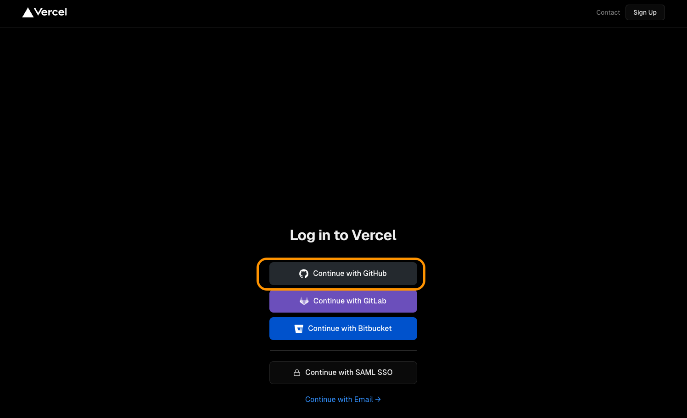
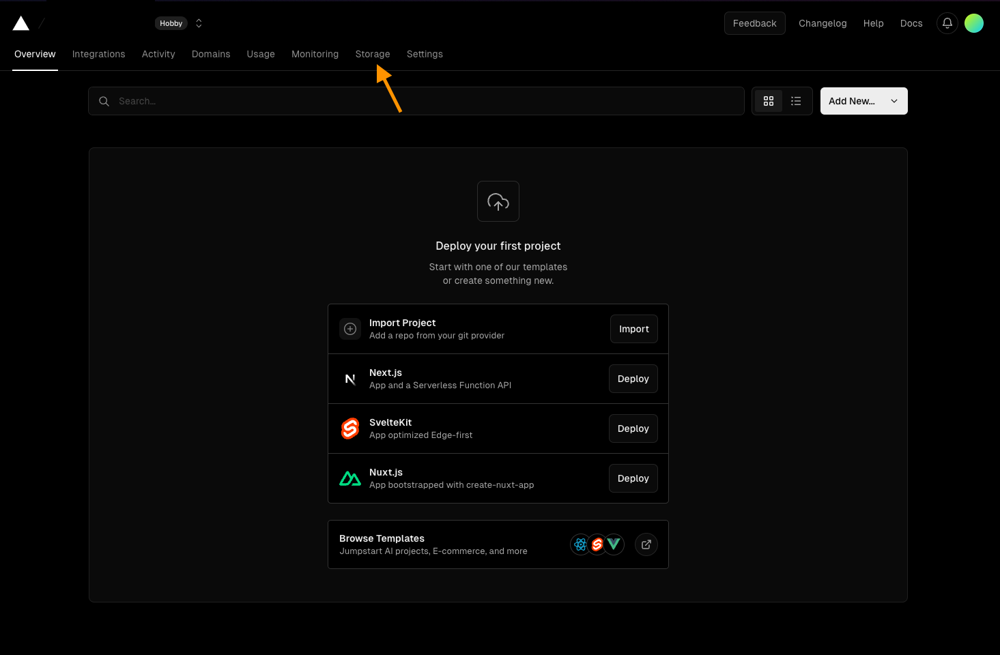
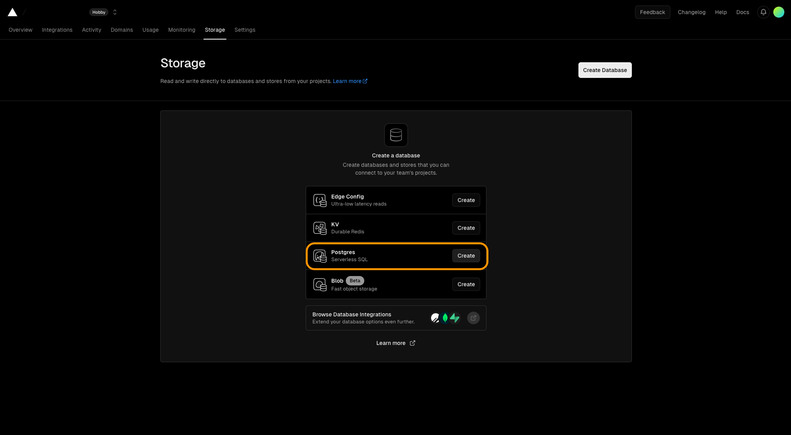
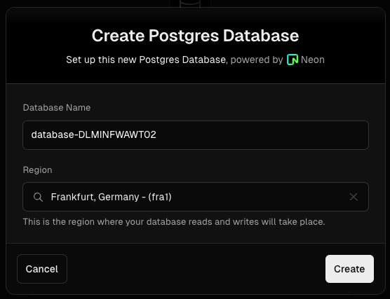
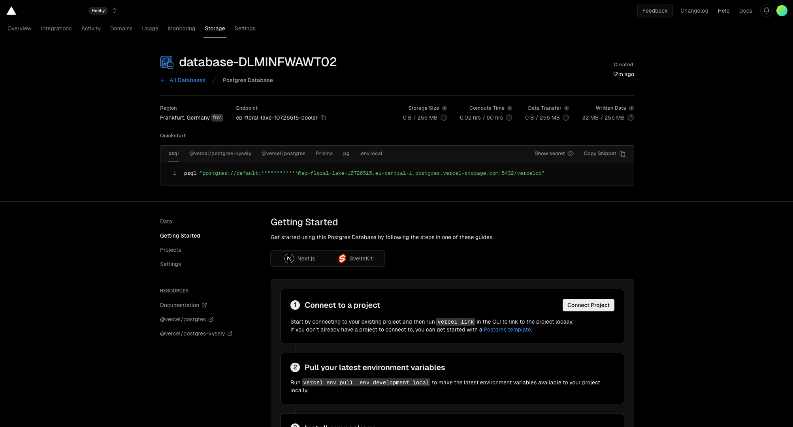

# Database Setup for Web Architecture Course

Welcome to the database setup section of our Web Architecture course. In this part, we will set up a serverless PostgreSQL database using Vercel. This process will involve integrating our database with GitHub for seamless development and deployment.

## Step 1: Log in to Vercel

1. **Access Vercel**: Visit [Vercel](https://vercel.com/) and click on the login page: [Vercel Login](https://vercel.com/login).

2. **GitHub Integration**: Select the option to log in using GitHub. This will streamline our development process and simplify deployments.
3. **Authenticate**: You may be prompted to authorize Vercel to access your GitHub account. Please allow this authentication.
4. **Redirection**: After successful login and authentication, you will be redirected to the Vercel homepage.

## Step 2: Create a Serverless PostgreSQL Database

1. **Navigate to Storage**: On the Vercel homepage, locate and click on the 'Storage' option. This is where you can manage database configurations.

2. **Database Setup**: Here, you will set up a new serverless PostgreSQL database. Fill in the required information as prompted.

3. **Completion**: Once you have entered all the necessary details and created the database, you should receive a confirmation with details of your newly created database.

---

### Note:
- Ensure you keep a record of your database credentials and connection details securely, as you'll need them for connecting your application to the database.
- In general, not for this course, familiarize yourself with the Vercel and PostgreSQL documentation for advanced configuration and troubleshooting.

---

Proceed to [Step 2: BackendDevelopment - FastAPI](../Step2_BackendDevelopment/README.md) to continue with the course.